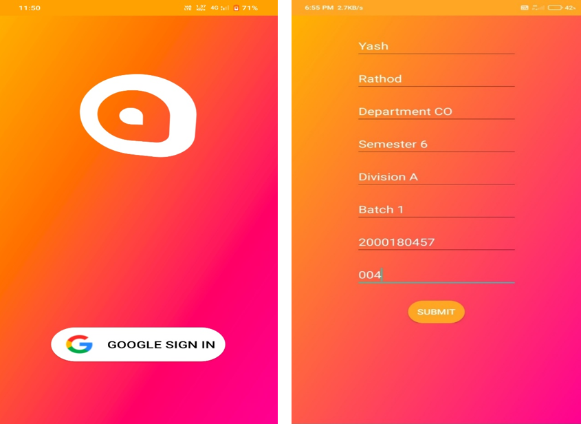
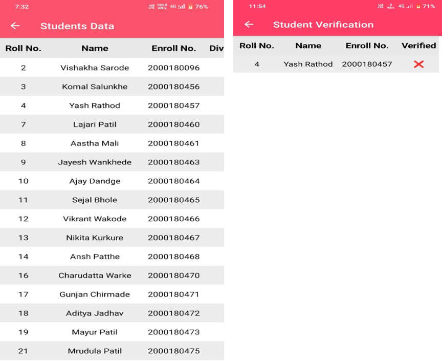

# Atten – Smart Attendance Tracking App

An Android-based smart attendance application designed to automate and secure attendance tracking using **geofencing, time-bound verification codes**, and **real-time notifications**.

---

## 🚀 Project Objective

To eliminate **proxy attendance**, enhance **attendance accuracy**, and automate the attendance workflow through:
- **Location-based check-ins** via GPS
- **Time-limited code verification**
- Seamless communication between students and faculty
- Mobile-first experience for ease of use

---

## 🧠 Key Highlights

- 📍 **Real-Time Location Validation**: Integrated **Google Maps API** to verify students' physical presence within predefined geofenced boundaries before allowing check-in.
- 🔐 **Secure Role-Based Access**: Used **Firebase Authentication & Firestore** for student/teacher login, role management, and data access control.
- 🛎️ **Instant Notifications**: Push notifications for attendance status, new schedules, test marks, and announcements.
- 📊 **Active Deployment**: Successfully used by over **300 students and faculty members**.

---

## 🧩 Features

### 🧑‍🎓 Student Features
- ✅ Secure Google Sign-In
- 🕒 Attendance marking with time-limited verification code
- 📍 Location-based geofencing for secure check-ins
- 📅 Lecture schedule and timetable view
- 🧾 Submission tracker & unit test marks view
- 🔔 Real-time push notifications
- 📝 Faculty feedback form

### 👨‍🏫 Teacher/Admin Features
- 🧾 Generate/stop/delete attendance codes
- 📊 Upload/view unit test marks
- 📈 Download monthly/yearly attendance reports
- 🎯 Filter students by attendance (e.g., below/above 75%)
- 🔄 Edit student details
- 🗣️ Send announcements/notifications
- 🧰 Manage student data and submissions
- ⚙️ Profile settings & feedback handling

---

## ⚙️ Tech Stack

| Category              | Technologies Used                          |
|-----------------------|---------------------------------------------|
| **Frontend**          | Java (Android SDK), XML                    |
| **Backend / Database**| Firebase (Auth, Firestore, Realtime DB)   |
| **Maps & Location**   | Google Maps API, GPS Location Services     |
| **Testing**           | Selenium, Apache JMeter          |
| **Build Tools**       | Android Studio                             |
| **Other Tools**       | MS Word, MS Excel                          |

---

## 🖼️ Screenshots

> Upload your screenshots to the `screenshots/` folder and update the paths below.

### Student App
#### 🔐 Login & Home

#### 📅 Schedule & Submissions

#### 🔔 Notifications & Feedback

---

### Teacher App
#### 🔐 Login & Dashboard

#### 📊 Attendance Tools

#### 📈 Student Data & Utilities

---

## 🔮 Future Scope

- ✅ Integration with college ERP systems
- 📍 Expand geofencing with WiFi/Bluetooth-based attendance
- 🧠 AI-based analytics for student attendance trends
- 📢 SMS/Email alerts for absenteeism
- 📈 Admin web dashboard for advanced reporting

---

## 📚 References

- [Firebase Docs](https://firebase.google.com/docs)
- [Android Developer Guide](https://developer.android.com/guide)
- [Google Maps API Docs](https://developers.google.com/maps/documentation)
- [Git SCM Docs](https://git-scm.com/docs/git)

---

## 📬 Contact

**Yash Rajendra Rathod**  
📧 yashr6577@gmail.com  
🔗 [LinkedIn](https://www.linkedin.com/in/yashrathod)

---
